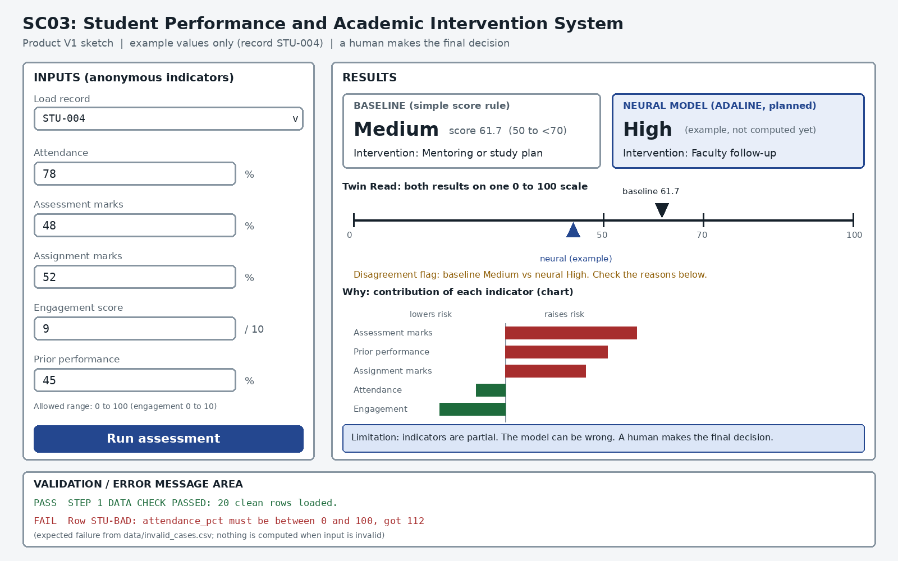

# Step 1 Project Contract

## Team and responsibilities

Replace the names below with your real team members before committing.

| Member (TODO: real name, GitHub username) | First responsibility | Exact Step 1 job |
| :--- | :--- | :--- |
| Member 1 | Repository | Create folders, add collaborators, test clone and run steps |
| Member 2 | Data | Write fields and units, make the sample, record sources |
| Member 3 | Baseline | Write simple rules and expected results for five cases |
| Member 4 | Testing and UI | Write validation, draw the screen, collect evidence |

For three students, Repository and Testing/UI are combined. These are first responsibilities, not permanent silos. Everyone must understand all of Step 1.

## One-sentence problem

Given anonymous academic indicators, estimate a risk band and suggest a supportive intervention.

## User of the product

A faculty mentor who wants early, supportive academic intervention information.

## Inputs and units

| Field | Meaning | Type / unit | Allowed range |
| :--- | :--- | :--- | :--- |
| `record_id` | Anonymous row name | text | `STU-001`, `STU-002`, ... unique |
| `attendance_pct` | Classes attended | percent | 0 to 100 |
| `assessment_pct` | Assessment marks | percent | 0 to 100 |
| `assignment_pct` | Assignment marks | percent | 0 to 100 |
| `engagement_score` | Participation indicator | score | 0 to 10 |
| `prior_performance_pct` | Earlier performance | percent | 0 to 100 |
| `risk_label` | Expected label for testing (target) | category | low, medium, high |

Missing values: the row is rejected. Full notes are in `data/README.md`.

## Outputs and units

- Risk category: low, medium or high
- One clear intervention: monitor, mentoring or study plan, or faculty follow-up

A human makes the final decision. The system never acts on a student automatically.

## Baseline method

All numbers below are **TEMPORARY** classroom values, not official standards.

1. Convert `engagement_score` to a percentage: `engagement_pct = engagement_score x 10`.
2. Calculate the visible score: `score = 0.30 x attendance_pct + 0.30 x assessment_pct + 0.20 x assignment_pct + 0.10 x engagement_pct + 0.10 x prior_performance_pct`.
3. Use temporary bands: score below 50 is high risk; 50 to below 70 is medium; 70 or more is low.
4. Map low to monitor, medium to mentoring or study plan, high to faculty follow-up.
5. State clearly that a human makes the final decision.

Pseudocode: `docs/baseline-pseudocode.md`. This baseline is not fuzzy logic, an ANN or a GA.

## Soft Computing method for M1

One transparent neural classifier and a simple score baseline, shown in a risk and intervention screen.

## Advanced method for M2

Compare Perceptron, ADALINE, and Backpropagation; study errors, imbalance, fairness, and deploy the app.

## Dataset/scenario sources

- **Step 1 sample:** `data/sample_input.csv` is a small **simulated** starter set written by the team (20 rows). Information used from the course guide: the five mandatory cases STU-001 to STU-005 and the baseline weights. It is not real data.
- **Step 2 plan:** a public anonymized dataset (URL, licence, columns, target, size and privacy limits will be recorded in `data/README.md`) or a clearly labelled simulated generator for 10,000+ records. Any proxy field will be labelled as a proxy.

## Five mandatory test cases

| Name | Input (attendance, assessment, assignment, engagement, prior) | Expected label | What to check | Baseline score | Baseline result |
| :--- | :--- | :--- | :--- | :--- | :--- |
| STU-001 | 92, 84, 88, 8, 81 | low | Consistently strong record | 86.5 | low, monitor |
| STU-002 | 42, 75, 78, 7, 74 | medium | Low attendance only | 65.1 | medium, mentoring or study plan |
| STU-003 | 55, 35, 30, 3, 40 | high | Several weak indicators | 40.0 | high, faculty follow-up |
| STU-004 | 78, 48, 52, 9, 45 | medium | High engagement but weak marks | 61.7 | medium, mentoring or study plan |
| STU-005 | 70, 60, 60, 5, 60 | medium | Boundary record | 62.0 | medium, mentoring or study plan |
| Invalid case | STU-BAD, 112, 84, 88, -1, 81, critical | n/a | Impossible values must be rejected | not computed | validator error (see `data/invalid_cases.csv`) |

## Product V1 screen sketch

The screen has an input area, a Run button, baseline and Soft Computing result areas (kept visibly different), an explanation chart, a limitation note, and a validation message area.

## Risks and assumptions

- The starter data is simulated, so results on it say nothing about real students.
- Baseline weights and thresholds are temporary and may change after Step 3 evaluation.
- `risk_label` values in the starter set are team judgment. STU-016, STU-017 and STU-019 deliberately disagree with the baseline.
- For the 10,000+ dataset the label must not be produced by the same formula as the baseline, otherwise the comparison is circular.
- Any proxy for attendance or engagement in a public dataset must be documented and labelled.
- The final design must not rank or punish students; wording must stay supportive.

## Step 1 completion evidence

| Evidence | Where |
| :--- | :--- |
| Repository and collaborators | GitHub repository, Settings, Collaborators |
| Project contract | `docs/STEP-1.md` |
| Data Dictionary | root `README.md`, `data/README.md` |
| 20 valid rows | `data/sample_input.csv` |
| Invalid cases | `data/invalid_cases.csv` |
| Baseline rules | `docs/baseline-pseudocode.md` |
| Validator | `src/validate_data.py` |
| PASS output | `results/step1/validation_pass.txt` |
| Expected FAIL output | `results/step1/validation_fail.txt` |
| Sketch | `docs/product-v1-sketch.png` |
| Commits from every member | GitHub, Commits tab |
